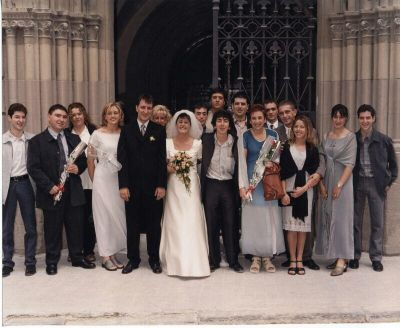

Gardel cantaba en su tango "Volver" que veinte años no eran nada.

Veinte años es una cifra como otra cualquiera, que bien podría ser veinticinco, que son los años desde que Raúl y Juana se casaron en la iglesia de San Lorenzo, aquella mañana de junio, bajo la mirada atenta de San Fermín.

En realidad, para los que les conocemos, especialmente sus amigos, esos veinticinco años (más unos cuantos más de noviazgo), son algo más que una cifra.

Es más de media vida, NUESTRA media vida.  

Ayer por la noche, en el Chester, viéndonos a todos en vivo, y mirando la foto que nos sacamos en vuestra boda hace 25 años, me di cuenta.

Hemos ido madurando con la edad, tanto física como mentalmente.

Salvo Oscar (y su pacto con su único dios) y su *cadera rockanrolera*, todos hemos ido cambiando.  
Bueno, Oscar también, aunque no lo quiera reconocer...

El *bebercio y el comercio* ya no nos sienta tan bien.  
Hemos cambiado el alcohol abrasante de los licores por cervezas sin alcohol o directamente por el agua; las resacas duran varios días... Algunos nos tenemos que sentar porque nuestro cuerpo no aguanta lo de antes.

Pero, en esencia, estábamos todos allí.

Raúl: Te conozco desde siempre. Pero has sido (y serás siempre) mi amigo.  
Desde que, como un *perrico* abandonado, me acerqué a la vera de la cuadrilla de mi primo Julián, donde estabais tú y Lalo, y un poco más tarde, Oscar.  

Hemos pasado por muchas aventuras y desventuras, todos juntos.

Particularmente, me vienen a la cabeza flashes, como los primeros sanfermines en los que estuvimos de *gaupasa*; la época de la ruta de la pescadilla, en la que fundíamos las madrugadas con nuestro desayuno particular en la cafetería "Trébol", mientras los demás se iban al "Repelentos"; el mirar las estrellas que colgaban del firmamento desde el balcón de nuestros puestos de guardia, primero en los campings sentados al calor de la fogata en la que se cocía una lata de callos, después en las casas rurales; los conciertos *heavies*, en especial aquel en el que nos acompañó Olaia, cuando aún teníamos la esperanza de que el demonio del reggaeton no se nos la llevase...  

También, hay alguno en el que se me escapan las lagrimillas, cuando siento tus abrazos de cariño y "se rozan nuestras barbas y nuestra panzas", pero, sobretodo, cuando paso cerca de la puerta del San Cristóbal, en donde me parece ver a tu padre al fondo, apoyado en la barra del bar, tomándose su chupito de pacharán, sacando un ducados del paquete abierto del revés, o escucho alguna canción del "Dúo Dinámico", y me imagino a tu madre y a la mía hablando sobre nosotros, en nuestra calle de siempre, la calle Lerín.

Juanita: A tí te conocí un poco más tarde, en aquellos sanfermines en los que te fuimos a buscar (Raúl y yo) a lo viejo, y tu "defendías tu territorio con uñas y dientes, tirando hasta de los pelos" (nosotros nos entendemos).  
Ese mismo año ya formaste parte de nuestra cuadrilla, a pesar de vivir en Burlada, a todo un mundo de nuestro territorio.

Recuerdo recorrer más de una vez el largo camino, y llegar sofocado por el calor y el esfuerzo a casa de tus padres, para explicarte alguna que otra lección del curso a distancia sobre informática que empezaste a hacer.  

Recuerdo (y conservo) aquella postal que me enviaste desde París; la *foto-poster* de "Siempre juntos" de la escapada a SOS del Rey Católico en aquella casa rural...

Siento con toda mi alma el haberte podido fallar alguna que otra vez, sobretodo cuando murió tu padre, y yo no me dí cuenta de que te hacía falta, absorto en mi puñetero trabajo. Lo siento, de verdad.  

Siempre me ha gustado de tí tu parte cabal. Será porque el 72 fue un buen año, y que eso nos ha dado siempre una conexión especial...  

Como tu dices, aunque no estemos juntos físicamente, sabes que siempre me tendrás ahí. Ya sabes que lo mismo que tú eres mi editora favorita, yo seré tu proveedor particular de lomos ibéricos.

Bueno, que me alargo...  

Durante estos veinticinco años han pasado muchas más cosas, se que me olvido de muchas.  
La más hermosa, con diferencia, ha sido la llegada de vuestra hija Olaia, cuya personalidad es una mezcla proporcionada de vosotros dos...

Os quiero, y os queremos.  
Desde hace más de veinticinco años, y, por lo menos, durante veinticinco años más.

